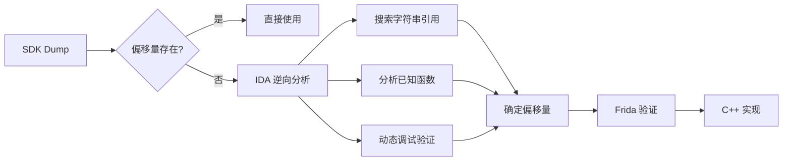

# 偏移量分析：Level_ActorsArray (0x98)

> **核心问题**: `constexpr uintptr_t Level_ActorsArray = 0x98;` 是怎么找到的？

> [!NOTE]
> **Writeup 来源** (存储于 NotebookLM)
> - [2024腾讯游戏安全安卓初赛复现](https://izayoishiki.github.io/2025/02/01/2024腾讯游戏安全安卓初赛复现/)
> - [2025 腾讯游戏安全技术竞赛 安卓初赛](https://lrhtony.cn/2025/03/29/2025TencentGame/)
> - [2025腾讯游戏安全安卓赛道初赛wp](https://jz5p.github.io/2025/03/28/2025腾讯游戏安全安卓赛道初赛wp/)
> - [52pojie 论坛帖子](https://www.52pojie.cn/thread-2024227-1-1.html)

---

## 1. 为什么 SDK.txt 里找不到

### 1.1 SDK Dump 的局限性

UE4Dumper 生成的 `SDK.txt` 只包含蓝图暴露的类，不包含引擎核心类

```diff
- 包含: AActor, ACharacter, APawn, UActorComponent...
- 不包含: UWorld, ULevel, FName 内部结构...
```

### 1.2 实际验证

```powershell
# 在 SDK.txt 中搜索关键类
grep "Class: Level" SDK.txt      # ❌ 无结果
grep "ULevel" SDK.txt            # ❌ 无结果
grep "PersistentLevel" SDK.txt   # ❌ 无结果
grep "World" SDK.txt             # ❌ 无结果

# Actor 类是存在的
grep "Class: Actor" SDK.txt      # ✅ 有结果，在第 200 行
```

**结论**: UE4Dumper 只 dump 了通过反射系统注册的 UClass，而 `UWorld` 和 `ULevel` 的成员变量没有完整暴露给蓝图系统

---

## 2. 0x98 的来源

### 2.1 三种获取途径

1. **UE4 源码** (Epic Games Access)：直接查看 `ULevel` 类定义
2. **游戏逆向**: 通过 IDA 分析 `GetActors()` 等函数
3. **社区 Writeup**: ACE2025 比赛 Writeup 直接给出

### 2.2 指针链结构

```
GWorld (libUE4.so + 0xAFAC398)
   │
   ├── +0x30: PersistentLevel (ULevel*)
   │              │
   │              ├── +0x98: Actors (TArray<AActor*>)
   │              │            ├── +0x00: Data (AActor**)
   │              │            └── +0x08: Count (uint32)
   │              ...
   ...
```

> [!IMPORTANT]
> `0x30` 和 `0x98` 都不在 SDK.txt 里，需要通过逆向分析获得

---

## 3. IDA 验证过程

### 3.0 关于截图中的代码

截图中的 switch/case 表是 UE4 反射系统的 **FName 字符串映射表**，不是游戏逻辑

```asm
loc_6A21564:              ; jumptable case 216
  ADRL X0, aPersistentleve ; "PersistentLevel"
  RET

loc_6A21570:              ; jumptable case 217
  ADRL X0, aTheworld       ; "TheWorld"
  RET
```

这只是返回属性名字符串的函数，类似于 `GetPropertyName(index)`，用于序列化和调试，没有偏移量信息

---

### 3.1 追踪 GWorld 的使用

**GWorld 地址**: `0xAFAC398` (位于 .bss 段)

**GWorld 的 xrefs (部分)**:
```
- sub_5AF8608 (小函数，检查 GWorld 是否存在)
- sub_5C00060 (大函数，世界初始化)
- SpawnActorInLevel (0x92B8C0C) ← 重点分析对象
```

---

### 3.2 0x30 的证据：SpawnActorInLevel (0x92B8C0C)

> [!TIP]
> IDA 中跳转到 `0x92B8C0C`，按 F5 反编译查看

#### 为什么叫 "SpawnActorInLevel"

**命名推理过程**:

1. **发现关键调用**: 这个函数内部调用了 `sub_8D2ED80`
2. **查 offsets.hpp**:
   ```cpp
   // [Source: NotebookLM WriteUp]
   constexpr uintptr_t SpawnProjectile_Func_Offset = 0x8D2ED80;
   ```
3. **Writeup 标注**: `0x8D2ED80` 是 SpawnProjectile/SpawnActor 函数
4. **推断**: 调用 SpawnActor 的函数，且传入 Level 参数 → `SpawnActorInLevel`

**Level 参数的关系 (0x30 的由来)**:
- 在该函数内部 (见下文代码分析)，有一行关键代码：`*(_QWORD *)(a1 + 48)`。
- `48` (十进制) = `0x30` (十六进制)。
- 已知 `a1` 是 `UWorld*` (因为它调用了 World 的成员函数)。
- `UWorld` + `0x30` 正是 `PersistentLevel` (ULevel*)。
- 该函数将读取到的 `Level` 指针传递给了后续的处理函数 `sub_8D2BBB8` (Level_ProcessActorArray)。
- **结论**: 这个函数显式地获取了 Level 对象并将 Actor 放入其中，因此命名为 `SpawnActorInLevel`。

---

#### Writeup 如何识别 SpawnActor

> [!WARNING]
> 在 IDA 中分析 `sub_8D2ED80` 没有找到 "SpawnActor" 字符串直接引用

**IDA 中找到的证据**:

##### 证据 1: "ActorSpawning" 字符串

```
地址 0x479cb66: "ActorSpawning"  ← UE4 SpawnActor 的特征字符串

Xrefs:
- 0x8d2e24c → sub_8D2E214
- 0x8d2e284 → sub_8D2E214
```

##### 证据 2: 调用链验证

```
UWorld_SpawnActor (0x8D2ED80)
    │
    └── 调用 sub_8D2E214 (内部实现)
                │
                └── 引用 "ActorSpawning" 字符串 ✓
```

---

#### 为什么 a1 是 this 指针

ARM64 调用约定 (AAPCS64) 规定 C++ 成员函数的 this 指针总是第一个隐式参数

| 架构 | this 指针位置 |
|------|---------------|
| ARM64 | **X0 寄存器** (第一个参数) |
| x86_64 | RDI 寄存器 (第一个参数) |
| x86 | ECX 寄存器 (__thiscall) |

**源码**:
```cpp
// UE4 源码
class UWorld {
    AActor* SpawnActor(UClass* Class, ...);  // 成员函数
};
```

**编译后 (ARM64)**:
```asm
; SpawnActor 被调用时
MOV X0, [GWorld]     ; this = UWorld* 放入 X0
MOV X1, ActorClass   ; 第一个显式参数
...
BL  UWorld_SpawnActor
```

**IDA 反编译**:
```c
// a1 就是 this (UWorld*)
__int64 UWorld_SpawnActor(__int64 a1, __int64 a2, ...)
//                        ^this
```

#### 如何判断一个函数是成员函数

**方法 1: 观察 a1 的使用模式**
```c
// 成员函数特征: a1 被用来访问偏移量 (成员变量)
v3 = *(_QWORD *)(a1 + 48);   // a1->member at offset 0x30
v4 = *(_DWORD *)(a1 + 8);    // a1->flags at offset 0x8

// 静态函数/普通函数: a1 是普通参数，没有成员访问模式
```

**方法 2: 观察调用方式 (需要看 caller)**
```asm
; 成员函数调用
LDR X0, [X19, #0x30]    ; 从对象/全局对象加载 this
MOV X1, SomeArg
BL  MemberFunction

; 静态/普通函数调用
MOV X0, SomeArg         ; 第一个参数就是正常参数
BL  StaticFunction
```

**方法 3: 虚表调用模式**
```asm
; 虚函数调用 (强烈暗示是成员函数)
LDR X8, [X0]            ; 加载虚表指针 (vptr 在对象开头)
LDR X9, [X8, #0x10]     ; 从虚表加载函数指针
BLR X9                  ; 调用虚函数
```

**方法 4: 源码对照**
- UE4 源码开源 (需 Epic 账号)
- 查找相似签名的成员函数
- 对照参数数量和类型

---

#### UE4 源码签名对照

**UE4 官方签名** (来自 [Epic Games 文档](https://docs.unrealengine.com)):
```cpp
AActor* UWorld::SpawnActor(
    UClass* Class,                    // 要生成的 Actor 类
    FVector const& Location,          // 位置
    FRotator const& Rotation,         // 旋转
    FActorSpawnParameters& Params     // 生成参数
);
```

**IDA 中 sub_8D2ED80 的签名**:
```c
__int64 UWorld_SpawnActor(
    __int64 a1,      // this = UWorld*
    __int64 a2,      // UClass*
    __int64* a3,     // FVector* (Location)
    __int64 a4,      // FRotator* (Rotation) 
    __int64 a5       // FActorSpawnParameters*
);
```

**对比结果**:

| 参数 | UE4 源码 | IDA 反编译 | ✓ |
|-----|----------|-----------|---|
| this | UWorld* | a1 (__int64) | ✅ |
| 参数 1 | UClass* | a2 (__int64) | ✅ |
| 参数 2 | FVector& | a3 (__int64*) | ✅ |
| 参数 3 | FRotator& | a4 (__int64) | ✅ |
| 参数 4 | SpawnParams& | a5 (__int64) | ✅ |
| 返回值 | AActor* | __int64 | ✅ |

签名完全匹配

**反编译代码关键行**:

```c
// 地址: 0x92b8c5c
sub_6A26320(v40, L"PersistentLevel", 1);  // [REV] 获取 FName

// 地址: 0x92b8dbc - 0x92b8ed0
v16 = *(_QWORD *)(*(_QWORD *)(a1 + 48) + 192LL);
//                           ^^^^^^^^
//                           a1 + 48 = a1 + 0x30
//                           [REV] a1 = UWorld*, a1+0x30 -> PersistentLevel

// 地址: 0x92b8ed0
sub_8D2BBB8(*(_QWORD *)(a1 + 48), v30);
//          ^^^^^^^^^^^^^^^^^^^
//          [REV] *(a1+0x30) = UWorld->PersistentLevel (ULevel*)
```

**48 = 0x30**:
```
48 (十进制) = 0x30 (十六进制)
```

---

### 为什么 a1 就是 UWorld*

这是逆向工程中的 **类型推理 (Type Inference)**

**推理过程**:

1. **观察字符串引用**: 函数中使用了 `L"PersistentLevel"`
   - `PersistentLevel` 是 UE4 中 `UWorld` 类的成员变量名
   - 强烈暗示此函数与 `UWorld` 相关

2. **观察偏移量访问**: `*(a1 + 48)` 被传给处理 Level 的函数
   - 查 UE4 源码/文档：`UWorld::PersistentLevel` 偏移量是 `0x30`
   - 48 = 0x30 ✅

3. **观察调用模式**:
   ```c
   sub_8D2BBB8(*(_QWORD *)(a1 + 48), v30);
   //          ^^^^^^^^^^^^^^^^^^^
   //          传入的是 ULevel*，说明 *(a1+0x30) 是 ULevel*
   //          而 UWorld->PersistentLevel 正是 ULevel*
   ```

4. **交叉验证**: 查看 GWorld 的 xref
   - 找到读取 `qword_AFAC398` (GWorld) 的函数
   - 看传给本函数的第一个参数是否来自 GWorld

**类型推理总结**:
```
a1 + 0x30 → 得到 ULevel*
         ↓
UWorld 中 PersistentLevel 的偏移量正好是 0x30
         ↓
因此 a1 = UWorld*
```

---

### 3.3 0x98 的证据：Level_ProcessActorArray (0x8D2BBB8)

> [!TIP]
> IDA 中跳转到 `0x8D2BBB8`，按 F5 反编译查看

`SpawnActorInLevel` 调用了 `Level_ProcessActorArray`，传入 `ULevel*`

```c
// 地址: 0x8d2bbdc
v3 = (const void **)(result + 152);  // [REV] result = ULevel*
//                           ^^^
//                           152 (十进制) = 0x98 (十六进制)
//                           这就是 Actors TArray.Data 的偏移量

// 地址: 0x8d2bbec  
v6 = 8LL * *(int *)(result + 160);   // [REV] result+0xA0 = Actors.Count
//                          ^^^
//                          160 (十进制) = 0xA0 (十六进制)
//                          0xA0 = 0x98 + 8 (Count 紧跟 Data 指针)
```

**换算**:
```
152 (十进制) = 0x98 (十六进制)
160 (十进制) = 0xA0 (十六进制)
```

### 为什么 result 就是 ULevel*

**推理过程**:

1. **观察调用来源**:
   ```c
   // 在 SpawnActorInLevel 中
   sub_8D2BBB8(*(_QWORD *)(a1 + 48), v30);
   //          ^^^^^^^^^^^^^^^^^^^
   //          这就是传给 Level_ProcessActorArray 的 result 参数
   //          已知 *(a1+0x30) = UWorld->PersistentLevel = ULevel*
   ```

2. **观察访问模式**: `result + 152` 和 `result + 160` 访问 TArray
   - 查 UE4 源码：`ULevel::Actors` 偏移量是 `0x98`
   - TArray 结构: `{Data*, Count, Max}`

3. **数据结构匹配**:
   ```
   result + 0x98 (152) → Data 指针 (AActor**)
   result + 0xA0 (160) → Count (int32)
   result + 0xA4 (164) → Max (int32)  ← 代码中也有访问
   ```

---

### 3.4 调用链总结

```
SpawnActorInLevel (0x92B8C0C)
    │
    │   a1 = UWorld*
    │
    ├── *(a1 + 0x30)  →  获取 ULevel* (PersistentLevel)
    │        ↓
    │        传给下一个函数
    │
    └── Level_ProcessActorArray(ULevel*, newActor)  ← 0x8D2BBB8
              │
              │   result = ULevel*
              │
              ├── result + 0x98 (152) = Actors.Data (AActor** 数组指针)
              │
              └── result + 0xA0 (160) = Actors.Count (数组元素个数)
```

---

### 3.5 自行验证步骤

1. IDA 中按 G，输入 `0x8D2BBB8`
2. 按 F5 打开反编译视图
3. 找到 line 19: `v3 = (const void **)(result + 152);`
   - 152 = **0x98**
4. 找到 line 22: `v6 = 8LL * *(int *)(result + 160);`
   - 160 = **0xA0**

### 3.6 Frida 动态验证

```javascript
// 动态验证 ULevel 结构
const pGWorld = Module.findBaseAddress("libUE4.so").add(0xAFAC398).readPointer();
const level = pGWorld.add(0x30).readPointer();

// 遍历可能的偏移量，找到 TArray 结构
for (let offset = 0x80; offset < 0xB0; offset += 8) {
    const ptr = level.add(offset).readPointer();
    const count = level.add(offset + 8).readU32();
    
    if (!ptr.isNull() && count > 0 && count < 1000) {
        console.log(`Offset 0x${offset.toString(16)}: ptr=${ptr}, count=${count}`);
        // 验证第一个元素是否是有效 Actor
        const firstActor = ptr.readPointer();
        // 尝试读取 FName...
    }
}
```

---

## 4. UE4.27 的 ULevel 结构 (参考)

```cpp
// 简化版结构
class ULevel : public UObject {
    // UObject 基类 ~0x28 字节
    
    // ... 其他成员 ...
    
    // +0x98: Actors 数组
    TArray<AActor*> Actors;  // TArray = { Data*, Count, Max }
    
    // ... 更多成员 ...
};
```

> [!NOTE]
> 不同 UE4 版本的偏移量可能不同。这个 0x98 是 **UE4.27 Android ARM64** 上的值

---

## 5. 总结：逆向分析工作流



### 关键认知

1. **SDK Dump 不是万能的** - 只能获取蓝图暴露的类成员
2. **引擎核心结构需要逆向** - `UWorld`, `ULevel`, `FName` 等
3. **版本依赖** - 偏移量随 UE4 版本和编译选项变化
4. **社区知识** - Writeup 和开源项目是重要资源

---

## 6. 相关文件

- [offsets.hpp](file:///d:/0Document/pgm/Android/ACE2025-Prelim-Zygisk/module/src/main/cpp/game/offsets.hpp) - 所有偏移量定义
- [actor_utils.hpp](file:///d:/0Document/pgm/Android/ACE2025-Prelim-Zygisk/module/src/main/cpp/game/actor_utils.hpp) - Actor 遍历实现
- [solve_speed.js](file:///d:/0Document/pgm/Android/ACE2025-Prelim-Zygisk/scripts/solve_speed.js#L14) - Frida 脚本中的偏移量使用
